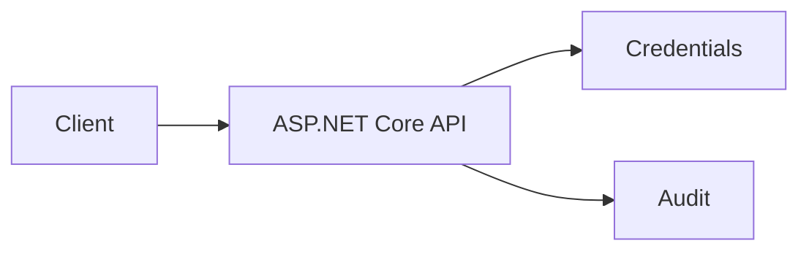
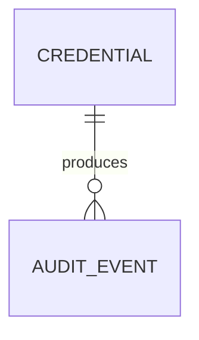
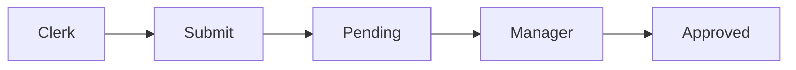
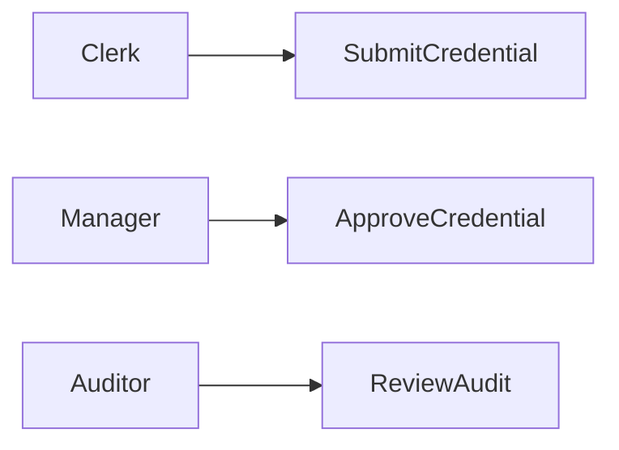
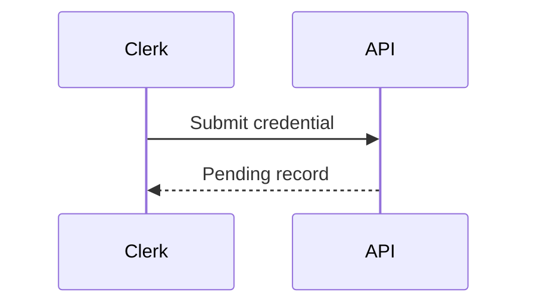

# Contractor Compliance Credential Platform
## The Problem
Contractor credentials are frequently managed through disconnected files, leaving operations teams unable to verify active insurance, training, and safety compliance before work begins.
## The Solution
This ASP.NET Core API records contractor credentials, limits submission to credential clerks, limits approval to compliance managers, and creates audit evidence for each controlled transition.
## Live Demo & Tech Stack
Run locally at `http://localhost:13000/api/credentials`. The stack uses .NET 8, ASP.NET Core controllers, xUnit tests, role-aware request headers, and automated CI.
## Local Setup & Run Instructions
```bash
dotnet test ContractorCompliance.Tests/ContractorCompliance.Tests.csproj
cd ContractorCompliance
ASPNETCORE_URLS=http://0.0.0.0:13000 dotnet run --no-launch-profile
```
Submit a credential with `X-Role: credential-clerk`, approve it with `X-Role: compliance-manager`, then retrieve `/api/credentials/audit`.
## System Documentation (Mermaid.js)
### Architecture

### ERD

### Data Flow

### Use Case

### Sequence

## Owner
Created and maintained by Kholipha Ahmmad Al-Amin.
Software Engineer and AI Specialist
Founder and CEO of EquiSaaS BD
Principal Consultant at AR IT Consultancy
Full Stack Developer and SaaS Product Builder
### Official links
Portfolio: https://kholipha-ahmmad-al-amin.equisaas-bd.com/
GitHub: https://github.com/kholipha-ahmmad-al-amin
LinkedIn: https://www.linkedin.com/in/kholipha-ahmmad-al-amin
X: https://x.com/al_amin5519
Facebook: https://www.facebook.com/kholipha.ahmmad.al.amin
Instagram: https://www.instagram.com/kholipha.ahmmad.al.amin
## Ownership
This project was created and is maintained by Kholipha Ahmmad Al-Amin.
